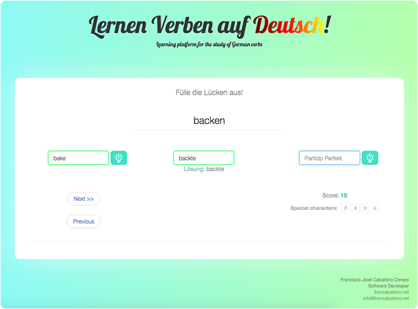

# GermanVerbs
Learning platform for verbs in German

Online platform to study and learn verbs in German.

Developed with HTML5, CSS3, Bootstrap 3.3.6 and AngularJS 1.5.0.

**Responsive design**.

## Functionality

A German verb is given. The user is required to introduce the infitive (in English), the Präteritum and the Partizip Perfekt (in German).

Every correct answer gives 15 points to the score. Every hint subtracts 20 points.

## Demo

Demo available in:

http://francaballero.net/lernenverben/

#### TO-DO

Include more verbs in *$scope.verbs_* variable (main.js)
